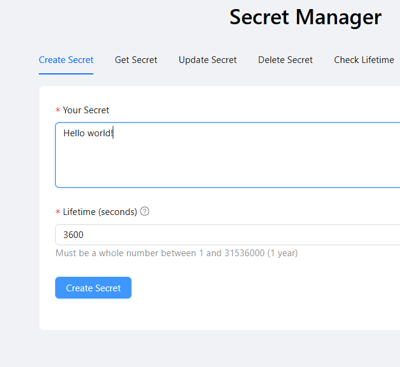
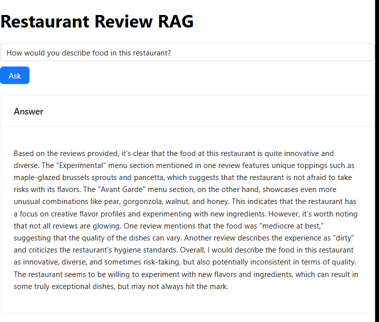
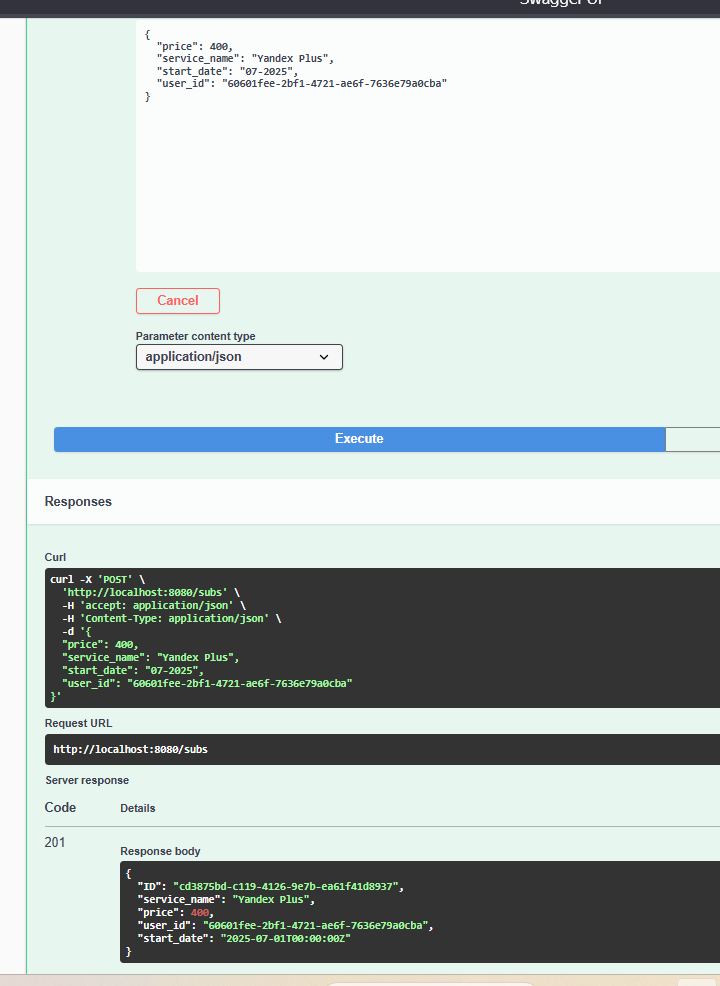
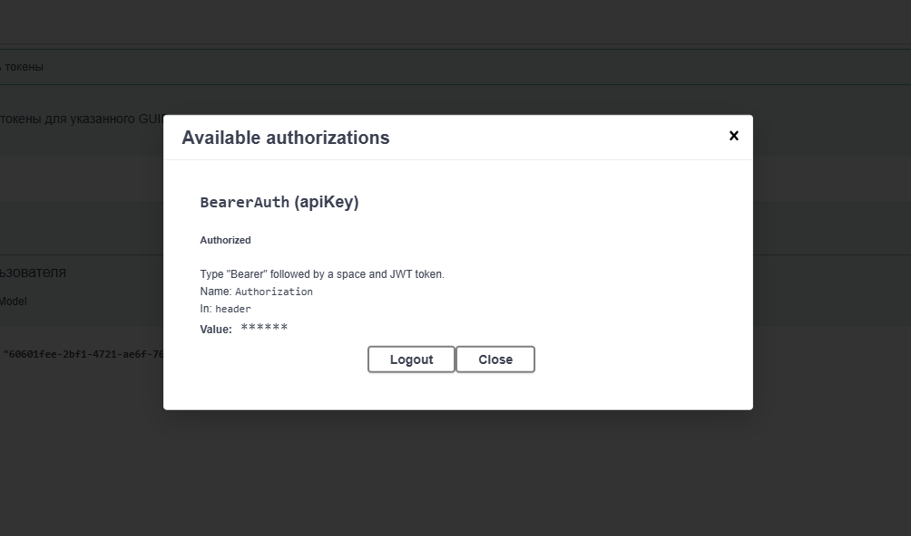

## Приветствую вас 👋 
# 👨‍💻 Backend Developer: Python & Golang

Привет! Я backend-разработчик с опытом создания высоконагруженных и распределенных систем. Владею современным стеком технологий на Python (FastAPI, асинхронное программирование) и Golang (Gin, GORM). Умею проектировать микросервисную архитектуру и работать с различными типами СУБД.

## 🔥 Ключевые навыки

**Python:**
- FastAPI (ASGI, Uvicorn)
- Асинхронное программирование (async/await)
- Работа с БД: PostgreSQL (asyncpg), Redis, ChromaDB
- ORM: SQLAlchemy, Alembic (миграции)
- Фоновые задачи: Celery + Redis
- Интеграция с LLM: Ollama, LangChain (RAG-пайплайны)
- Docker-контейнеризация (multistage build)

**Golang:**
- Веб-фреймворки: Gin, Echo
- Работа с БД: PostgreSQL (pgx), GORM
- Аутентификация: JWT
- Документирование: Swagger
- Логирование: zap/slog

**Infrastructure:**
- Docker + Docker Compose
- Проектирование микросервисной архитектуры
- Векторные базы данных (ChromaDB)
- Message brokers (Redis)

## 🛠 Пет-проекты

### 1. Secret Sharing Service (Python/FastAPI/React)
https://github.com/Imarzhobaboba/confidential_data_keeper
 
**Стек:**
- Backend: FastAPI (ASGI), PostgreSQL (asyncpg), Redis, APScheduler
- Шифрование: Fernet (cryptography)
- Миграции: Alembic
- Frontend: React 18 + Vite + Ant Design
- Инфраструктура: Docker (мультиконтейнерное приложение)

**Что реализовано:**
✔ Асинхронный API для безопасного обмена секретами  
✔ Автоматическое удаление просроченных записей через APScheduler  
✔ Симметричное шифрование с автогенерацией ключей  
✔ Полноценный SPA-фронтенд с адаптивным дизайном  

---

### 2. RAG Q&A System with LLM (Python/FastAPI/Ollama)
https://github.com/Imarzhobaboba/restaurant-reviewer-ai-agent
  
**Стек:**
- Ollama (llama3, mxbai-embed-large)
- Векторная БД: ChromaDB (SQLite mode)
- Асинхронная обработка: Celery + Redis
- LangChain для RAG-пайплайнов
- Docker-контейнеризация всех компонентов

**Что реализовано:**
✔ Полноценная RAG-система с локальными LLM  
✔ Асинхронная обработка запросов через Celery  
✔ Оптимизированная работа с эмбеддингами  
✔ Упрощенный деплой через SQLite-режим ChromaDB  

---

### 3. Subscription Management API (Golang/Gin/GORM)
https://github.com/Imarzhobaboba/effective_mobile
  
**Стек:**
- Gin Framework
- PostgreSQL + GORM
- Swagger-документирование
- Логирование в файл
- Docker-развертывание

**Что реализовано:**
✔ REST API для управления подписками  
✔ Расчет стоимости подписок за период  
✔ Чистая слоистая архитектура  
✔ Полная Swagger-документация  

---

### 4. JWT Auth Service (Golang/Gin)
https://github.com/Imarzhobaboba/medods
  
**Стек:**
- JWT-аутентификация
- GORM (модели PostgreSQL)
- Конфигурирование через .env
- Middleware для защиты роутов

**Что реализовано:**
✔ Система аутентификации с JWT  
✔ Ролевая модель доступа  
✔ Валидация токенов  

## 📈 Что меня выделяет
- Умею работать как с реляционными (PostgreSQL), так и с NoSQL (Redis, ChromaDB) базами
- Понимаю принципы асинхронной обработки запросов (Celery/Redis в Python, goroutines в Golang)
- Опыт интеграции LLM в production-окружении
- Слежу за качеством кода: типизация, логирование, документирование API
- Умею настраивать CI/CD для пет-проектов

## 📫 Как со мной связаться
контакты: @Ilya_FfFfFf, filia150@mail.ru
